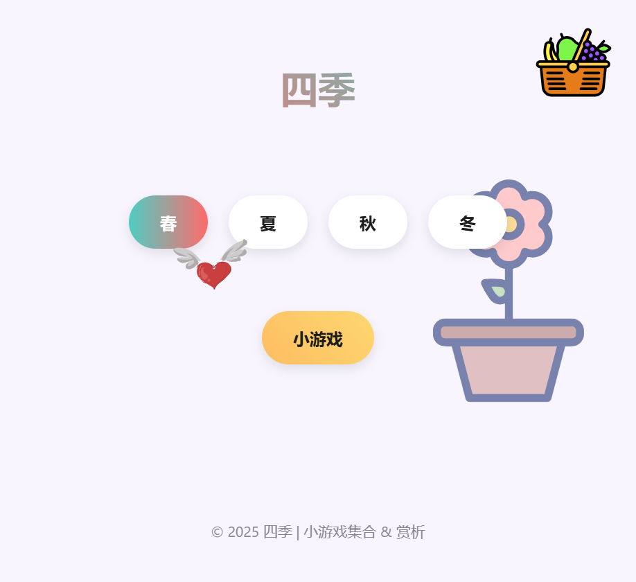

# 四季风景 & 游戏集合 
*一个展示像素艺术四季风景并集成多款小游戏的互动 Web 应用*

---

## 项目简介

"四季风景 & 游戏集合"是一个融合像素艺术与多种互动游戏的 Web 应用。用户可以欣赏春、夏、秋、冬四季的像素风景，并体验多款精心设计的小游戏。项目采用纯前端技术开发，支持桌面端和移动端访问。

## 功能特性

- **四季风景系统**
  - 动态季节切换：支持春、夏、秋、冬四季主题切换
  - 多样化背景：每个季节有多张随机背景图
  - 特殊序列：特定季节切换组合可解锁隐藏功能
- **游戏集合**
  - **贪吃蛇游戏**：
    - 生命值系统：3条命，碰撞后短暂无敌
    - 怪物与火焰：中央有喷火怪物
    - 特殊水果：收集获得发射子弹能力
    - 咬身体机制：允许一次咬断自己身体，减少分数和长度
  - **俄罗斯方块**：
    - 等级系统与难度递增
    - 下一个方块预览功能
  - **炸金花扑克牌游戏**：
    - AI对手与筹码管理系统
  - **恐龙跳跃游戏**：
    - 经典跑酷玩法，收集水果获得无敌状态
- **数据和交互系统**
  - 实时排行榜：基于云数据库的全球排行榜
  - 游戏状态保存：保存和恢复游戏进度
  - 浮动水果系统：可互动的物理效果水果
- **响应式设计**：适配桌面端和移动端，优化触控体验。

## 安装与运行

### 前提条件
- 任意现代浏览器（Chrome、Firefox、Safari 等）。

### 步骤
1. 克隆仓库到本地：
   ```bash
   git clone https://github.com/DivineBrightness/test-Greedy-Snake.git
   ```
2. 进入项目目录：
   ```bash
   cd test-Greedy-Snake
   ```
3. 直接在浏览器中打开 `index.html` 文件：
   - 在文件资源管理器中双击 `index.html`，或
   - 使用命令行启动本地服务器（推荐）：
     ```bash
     python -m http.server 8000  # Python 3
     ```
     然后访问 `http://localhost:8000`。

## 使用方法

1. **切换季节**：点击页面中的“春季”、“夏季”、“秋季”、“冬季”按钮，欣赏不同的像素艺术风景。
2. **进入游戏**：点击“进入贪吃蛇游戏”按钮，开始游戏。
3. **游戏控制**：
   - **桌面端**：使用方向键（↑↓←→）或 WASD 控制蛇的移动，空格键暂停/继续。
   - **移动端**：使用屏幕上的虚拟按键（十字形布局）操作。
4. **返回风景**：游戏中点击“返回风景”按钮，回到四季展示页面。

## 屏幕截图

- 四季展示：  
    

## 贡献指南

欢迎为项目贡献代码或提出建议！请按照以下步骤操作：
1. Fork 本仓库。
2. 创建你的特性分支：
   ```bash
   git checkout -b feature/你的功能
   ```
3. 提交更改：
   ```bash
   git commit -m "添加新功能：描述"
   ```
4. 推送到远程分支：
   ```bash
   git push origin feature/你的功能
   ```
5. 创建 Pull Request。

如有问题或建议，请提交 [Issue](https://github.com/DivineBrightness/test-Greedy-Snake/issues)。

## 更新日志
### 版本 1.5.2 - 2025年4月7日
- **新增**：
  - 小恐龙跳跃游戏
### 版本 1.5.1 - 2025年4月1日
- **调整**：
  - 浏览器缓存
  - 修改扑克牌游戏
- **优化**：
  - 贪吃蛇游戏
### 版本 1.5.0 - 2025年3月31日
- **新增**：
  - 芙莉莲页面
  - 扑克牌游戏
  - 宝可梦球
- **优化**：
  - 贪吃蛇小游戏
### 版本 1.4.2 - 2025年3月26日
- **新增**：
  - 猫咪说
- **优化**：
  - 添加更多四季图片
### 版本 1.4.1 - 2025年3月25日
- **新增**：
  - 春秋页面
  - 每日一话页面
  - 捕捉宝可梦功能
- **调整**：
  - 随机化飞心位置
- **优化**：
  - 飞心可拖动到屏幕外
  - 修复返回键bug
### 版本 1.4.0 - 2025年3月23日
- **新增**：
  - 首页水果小游戏
  - 添加小宝箱页面
- **优化**：
  - 安全验证功能
### 版本 1.3.5 - 2025年3月22日
- **新增**：
  - 记录访客信息
  - 添加自定义输入玩家名字的功能
  - 为主页添加水果漂浮动画
  - 贪吃蛇加一颗心
- **调整**：
  - 排行榜展示前5名
- **优化**：
  - 数据库保存数据优化
  - 前三名图标替换
  - 自定义名字最多12个字
### 版本 1.3.4 - 2025年3月21日
- **新增**：
  - 暂停保存进度功能
- **调整**：
  - 四季图片作为背景，同时调节透明度相关
  - 人物调整
- **优化**：
  - 冬季图片不变透明问题
  - 手机上"选择游戏"居中问题
  - 多次点击暂停闪烁问题
  - 暂停弹窗
  - 俄罗斯方块难度以及分数优化
### 版本 1.3.3 - 2025年3月20日
  - **优化**：
    - 排行榜排版。
    - 长按左右键加速移动功能。
    - 添加不提交分数返回键。
    - 美化页面。
  - **修复**：
    - 俄罗斯方块当下一个方块和当前方块相同时出现的旋转同步问题。
### 版本 1.3.2 - 2025年3月19日
- **优化**：
  - 按钮边框问题。
  - 贪吃蛇排行榜显示问题。
  - 添加图标（来源：https://iconscout.com）
- **新增**：
  - 俄罗斯方块排行榜按钮。
### 版本 1.3.1 - 2025年3月18日
- **调整**：
  - 调整favicon图标
### 版本 1.3.0 - 2025年3月16日
- **新增**：
  - 实时游戏排行榜功能（前三名展示），基于 Cloudflare Workers 和 D1 数据库构建。
- **调整**：
  - 重构代码，增强可维护性。
- **优化**：
  - 移动端新增一键下落功能。
  - 俄罗斯方块小游戏添加背景方格。
  - 通过 Worker 无服务架构实现毫秒级分数同步
### 版本 1.2.0 - 2025年3月15日
- **新增**：
  - 集成俄罗斯方块游戏：新增俄罗斯方块小游戏，支持键盘和移动端控制，用户可通过点击“进入俄罗斯方块游戏”按钮体验。
  - 等级系统：为俄罗斯方块添加等级机制，随着分数增加（每1000分升一级），游戏难度和方块下落速度逐步提升。
  - “下一个方块”预览：实现预览功能，显示即将出现的下一个方块，提升游戏策略性。
  - 移动端虚拟按键：优化移动端控制布局，新增旋转、左右移动和加速下落按钮，支持触控操作。
### 版本 1.1.0 - 2025年3月14日
- **优化**：
  - 移动端贪吃蛇虚拟按键布局调整为十字形，提升操作直观性和舒适度。
  - 增大按钮尺寸（50px -> 60px）及间距，优化触控体验。
- **调整**：
  - 重构 HTML `.mobile-controls` 结构，新增 `.control-row` 分行布局。
  - 更新 CSS 样式，支持新按键布局。
### 版本 1.0.0 - 2025年3月13日
- **新增**：
  - 初始版本，包含四季像素艺术展示（春、夏、秋、冬）。
  - 集成贪吃蛇游戏，支持键盘和移动端控制。
  - 添加分数记录及本地存储最高分功能。

*后续更新将记录在此处，敬请关注！*

## 许可证

本项目采用 [MIT 许可证](LICENSE.txt) 开源，欢迎自由使用和修改。

## 联系方式

- **开发者**：divine
- **GitHub**：[@DivineBrightness](https://github.com/DivineBrightness)

